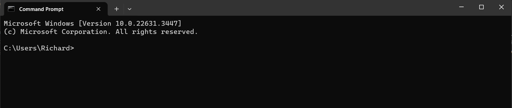

# Organize Files

<!-- !!! info
    These instructions are intended for windows users.

    These commands do may not work on external cloud drives (i.e., Google Drive, oneDrive, etc.). -->

<b> Introduction</b>
 
This guide is designed to teach you basic file organization skills using Windows command Prompt.
You'll learn how to efficiently create, navigate, and manage directories and files. By mastering these 
command-line operations, you'll unlock a new level of proficiency, allowing you to 
streamline your workflows and keep your digital workspace organized and accessible.

!!! tip
    Maintain a structured folder hierarchy for better organization and ease of access.

1. Open the Command Prompt by pressing `Windows Key + R`, typing `cmd`, and pressing
`Enter`.

    <figure markdown="span">
    { height="800"}
    <figcaption>Command Prompt window</figcaption>
    </figure>


2. Navigate to your desired directory using the `cd` command. 

    !!! note
        you can only change locations properly if you write the full address

        If you do not write the full address, you may need to use cd.. to navigate backwards.

        For example. moving from documents to downloads
        ```bash
        cd Documents
        cd ..
        cd Downloads
        ``` 

    ```bash
    cd [directory address]
    ```

    <i> For Example: </i>
    ```bash
    cd C:\[Users]\[user]\Documents
    ```


3. Create a new directory using `mkdir`. 

    ```bash
    mkdir [Folder Name]
    ```

    <i> For instance: </i>
    ```
    mkdir NewFolder
    ```

    !!! note

        If you already have a folder with the same file.name in the directory, it will not create a new folder.


4. Navigate to the newly created directory with `cd`:
    ```bash
    cd [Folder Name]
    ```

    <i> Example: </i>
    ```bash
    cd NewFolder
    ```

5. Create a new file by using `echo`. 
    ```bash
    echo. > [file name].txt
    ```

    <i> For example: </i>
    ```bash
    echo. > newfile.txt
    ```

6. Open the file with a text editor.
    ```bash
    [txt editor] [file name].txt
    ``` 

    <i> For example, </i> use Notepad: 

    ```bash
    notepad newfile.txt
    ```

7. Write content to the file using `echo`. 
    ```bash
    echo [content] >> [file name].txt
    ```

    <i> For instance: </i>
    ```bash
    echo Hello, World! >> newfile.txt
    ```

8. Verify the file's content with `type`:

    ```bash
    type [filename].txt
    ```
    <i> For example </i>
    ```bash
    type newfile.txt
    ```


<b>Conclusion</b>

Well done on completing this comprehensive guide to organizing files with the 
Command Prompt. You've learned how to create directories, navigate through your 
file system, manage files, and ensure your digital space is neatly arranged. 

Now, you can go to [Search and Move Files](SearchMove.md) to discover how to search for files and move them around within your file system.
