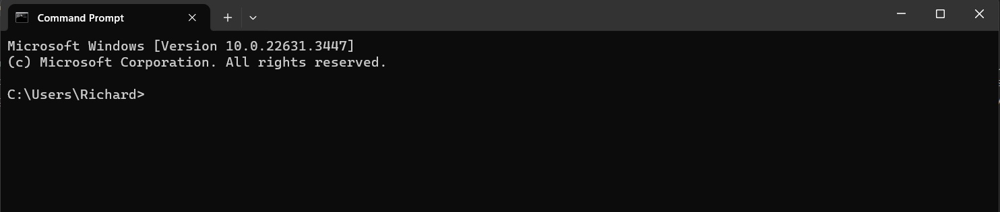

# Search and Move Files


<b>Overview</b>

This command line guide presents fundamental skills for effective file management. Whether locating text files within nested directories or relocating batches of data, the skills you acquire today will prove invaluable in the long term.

1. Open the Command Prompt by pressing `Windows Key + R`, typing `cmd`, and pressing
Enter.

    <figure markdown="span">
    { height="800"}
    <figcaption>Command Prompt window</figcaption>
    </figure>

2. Use the `dir` command to search for files. For example, to find all `.txt` files in
a directory:

    <i>For example</i>, to find all `.txt` files in a directory:
    ```bash
    dir /s /b *.txt
    ```
    <i>For example</i>, to find a specific .txt file in a directory:
    ```bash
    dir /s /b [filename].txt
    ```
    <i>For example</i>, to find a file named 'file.txt' in a directory:
    ```bash
    dir /s /b file.txt
    ```

3. Move a file to a new location with the `move` command:


    ```bash
    move C:\[path]\[to]\[source]\[file name].txt C:\[path]\[to]\[destination]\
    ```
    <i>For example</i> To move 'file.txt' from downloads of user Richard to documents:
    ```
    move C:\Users\Richard\Downloads\file.txt C:\Users\Richard\Documents
    ```

4. Check that the file has been moved to the new location:

    ```bash
    dir C:\path\to\destination\
    ```

5. Copy a file with the `copy` command:

    ```bash
    copy C:\path\to\source\filename.txt C:\path\to\destination\filename.txt
    ```

6. Rename a file using the `ren` or `rename` command:

    ```bash
    ren C:\path\to\filename.txt newfilename.txt
    ```

7. Search for a specific string within files using `findstr`:

    ```bash
    findstr /s "searchstring" *.txt
    ```

8. Organize Search Results by sorting the search results by name or date using `dir` with sorting flags:

    ```bash
    dir /b /o:n *.txt
    ```


9. Move only certain files using wildcards with `move`:

    ```bash
    move C:\path\to\source\*.txt C:\path\to\destination\
    ```

10. Recreate the directory structure in the destination using `xcopy`:

    ```bash
    xcopy /t /e C:\path\to\source\ C:\path\to\destination\
    ```


<b>Conclusion</b>

Congratulations on completing this guide to searching and moving files with the 
Windows Command Prompt.

Now, you might be need [Delete Files](DeletingFiles.md) to understand the commands for safely deleting files and directories.


